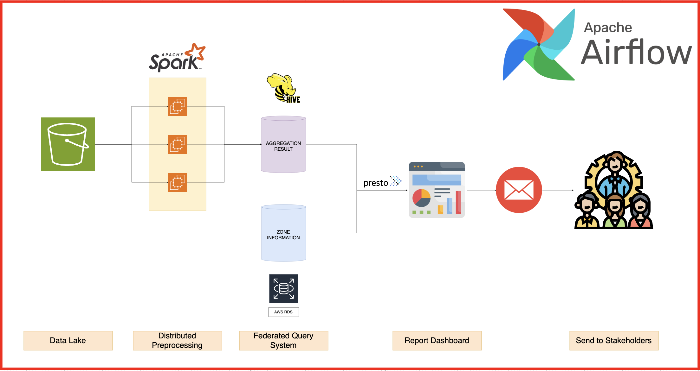
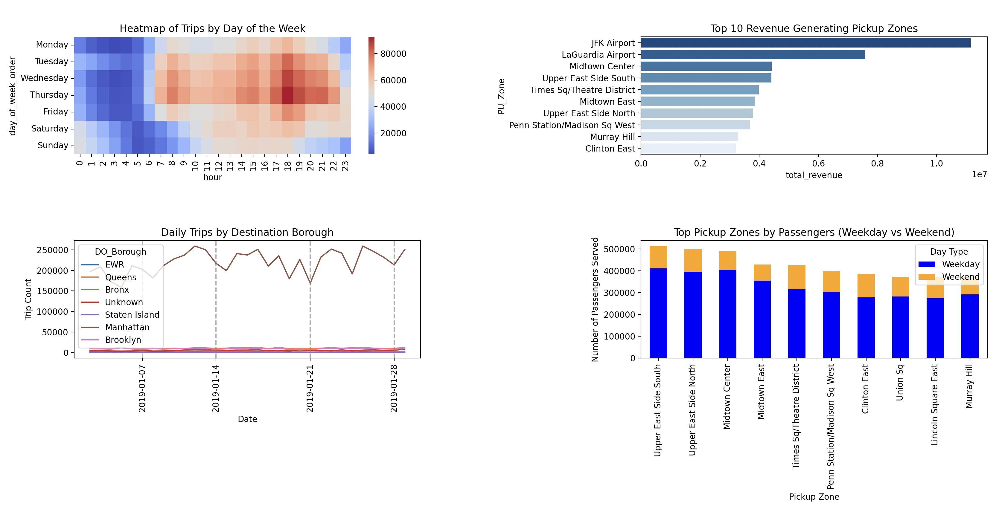

# RideBatch
A Data Pipeline for Generating Monthly Report of a Ride Hailing Company

## System Design

Note: Implementation is still in progress

## Preview of Monthly Dashboard

Some insights that can be derived from **January 2020** report:
- JFK Airport managed to attract customers that generated over $10,000,000 
- The taxi are mostly used for rush hour (coming and leaving office) and slightly on the midnight of weekend
- Manhattan was a favourite place for destination regardless of whether it's weekday or weekend
- Based on the number of passengers served, there are several potential zones which requires more taxi cars availability during weekdays, especially at the Manhattan Borough (Upper East Side South, Upper East Side North, and Midtown Center)

## Progress

### What's done:
- Designed the pipeline architecture
- Identify insights which may be useful for business stakeholders

### What's pending:
- AWS Deployment (Spark, Airflow, Presto, RDS)
- Frontend for Interactive Dashboard (Streamlit)
- Email Testing
- Code cleaning

## Credit
 Thanks to https://www.kaggle.com/datasets/microize/newyork-yellow-taxi-trip-data-2020-2019/data